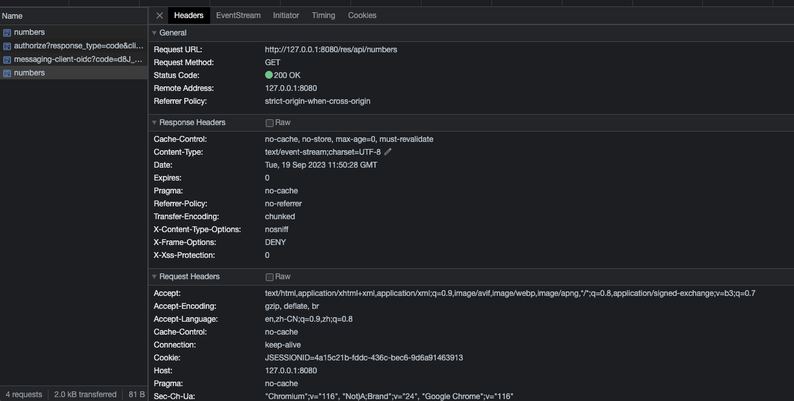

## spring-security-oauth (legacy)

- [code base](https://github.com/spring-attic/spring-security-oauth)
- [samples](https://github.com/spring-attic/spring-security-oauth/tree/main/samples)
- [oauth2.0 samples](https://github.com/jgrandja/spring-security-oauth-2-4-migrate)

## OAuth 2.0 Migration

- [OAuth-2.0-Migration-Guide](https://github.com/spring-projects/spring-security/wiki/OAuth-2.0-Migration-Guide)
- [announcing-the-spring-authorization-server](https://spring.io/blog/2020/04/15/announcing-the-spring-authorization-server)
- [Authorization Server Official Doc](https://docs.spring.io/spring-authorization-server/docs/current/reference/html/)
- [spring-authorization-server](https://github.com/spring-projects/spring-authorization-server)
- [Official Samples](https://github.com/spring-projects/spring-authorization-server/tree/main/samples)
- [Official Samples](https://github.com/spring-projects/spring-security-samples)

## Tips

- 有三个角色，Authorization Server、Resources Server、Client，这里AuthServer和ResServer是一起的，Client可以看作是TP，
  User通过Client访问ResServer，需要使用从AuthServer申请的Token，之后Client使用Token访问ResServer，ResServer会找AuthServer
  validate Provided-Token
- 在使用OAuth2-Client时，会将相关token存储在session中，从而Call端只需要传Cookie(包含JSESSIONID,SESSION)即可，
  并且会自动refresh，这一点可以说是十分省心了，不需要Maintain Token，也不需要Refresh.
  在method中，可通过 ReactiveSecurityContextHolder.getContext() 获取SecurityContext
- 在OAuth2-Client中，需修改CookieName为JSESSIONID，OAuth2-Client对需route的request
  bypass，重启后再以原JSESSIONID发起request将自动重新oauth并更新Cookie中的JSESSIONID（Set-Cookie）。
  然后携带新的JSESSIONID发起Request。
    - 重启后访问resource-server，将自动redirect到oauth2-server
      
    - oauth2-server返回oauth-code
      
    - oauth2-client使用oauth-code获取新的token，并更新cookie
      
    - 使用新的token访问resource-server
      

- 在AuthServer中的User和Register进来的Client，User有Roles，Client有Scopes，这俩功能还不是特别清楚，已知Register时确定的scope明确了在申请token时可以选择的scope，
  在访问Res时，Res的AccessControl也是基于scope的，AccessToken中有User的Identity，感觉在ResServer会基于此作些Datalayer的Control。
  Roles 是定义在用户身上的，它指示了一个用户能够访问哪些资源。而 Scopes 则是定义在客户端身上的，它表示了客户端能够访问哪些资源。资源包括API及Data。
  OAuth2.0 的授权机制是基于 Scopes 的。也就是说，当客户端申请访问令牌时，需要指定所需要的 Scopes。授权服务器会根据客户端所请求的
  Scopes，来生成相应的访问令牌。
  因此，在 OAuth2.0 的授权过程中，Scopes 是起到关键作用的，而 Roles 则主要用于用户的权限控制。

  综上：AccessToken做ResServer的AccessControl，在ResServer可以从AccessToken中获取User Id，并可使用IdToken向AuthServer
  Request User-Entitlement，然后做些Datalevel的Control，
  [详见 User Info](https://docs.spring.io/spring-authorization-server/docs/current/reference/html/guides/how-to-userinfo.html#enable-user-info)
- 授权模式
  客户端必须得到用户的授权（authorization grant），才能获得令牌（access token）。OAuth 2.0一共分成四种授权类型（authorization
  grant）

    - 授权码模式（authorization code）
    - 简化模式（implicit）
    - 密码模式（resource owner password credentials）
    - 客户端模式（client credentials）

  授权码模式和密码模式比较常用。但密码模式已经不推荐使用了

  第三方应用申请令牌之前，都必须先到系统备案，说明自己的身份，然后会拿到两个身份识别码：客户端 ID（client ID）和客户端密钥（client
  secret）。这是为了防止令牌被滥用，没有备案过的第三方应用，是不会拿到令牌的。

- [User Authentication with OAuth 2.0](https://oauth.net/articles/authentication/)
- OpenID Connect 是在OAuth2.0 协议基础上增加了身份验证层 （identity layer）。OAuth 2.0 定义了通过access
  token去获取请求资源的机制，但是没有定义提供用户身份信息的标准方法。OpenID Connect作为OAuth2.0的扩展，
  实现了Authentication的流程。OpenID Connect根据用户的 id_token 来验证用户，并获取用户的基本信息。
- OpenID Connect流程主要涉及如下几个步骤：

    - 发现获取OIDC metadata
    - 执行OAuth流程，获取id_token和access_token。例如：在 Authorization code模式下即为通过code来换取id_token和access_token。
    - 获取JWT签名（signature key）并且可选的动态的注册客户端应用
    - 基于日期签名来本地验证JWT id_token，或者将id_token发给后端backend进行验证
    - 根据id_token通过UserInfo Endpoint获取用户信息，根据access_token获取用户其他资源信息

- 当访问client时，其会自己维护SecurityContext，并自动refresh，其原理见
  ServerOAuth2AuthorizedClientExchangeFilterFunction.oauth2AuthorizedClient 注释
- ~~但作为GateWay时，有些不一样，理论上是需要Call传Token的，那么相关维护都要那端了~~
